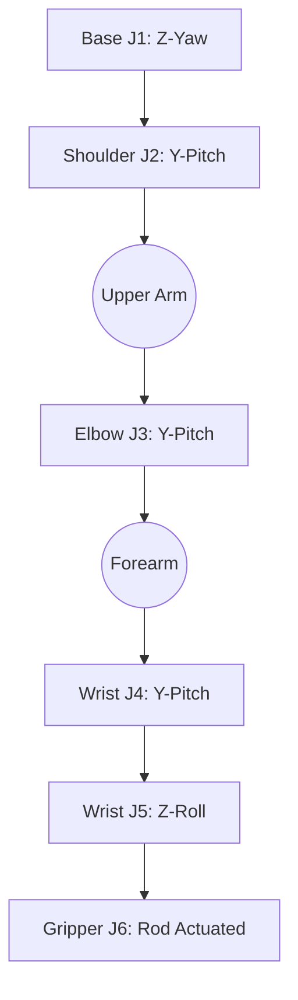

# Kinematics and Coordinate Frames

To ensure precise control and simulation (URDF/MuJoCo), we define two types of coordinate frames.

## 1. World Reference Frame (The Table)
This frame is fixed to the base of the robot and the work surface.
*   **+Z Axis**: Vertically UP (against gravity).
*   **+X Axis**: Forward (towards the front of the robot).
*   **+Y Axis**: Left (following the Right-Hand Rule).

## 2. Local Joint Frames (Zero Pose)
The axes below refer to the joint rotation when the robot is in its **Zero Pose** (pointing straight up like a pillar).

| Joint | World Alignment | Rotation Axis | Description |
| :--- | :---: | :---: | :--- |
| **J1 (Base)** | Z | Z | Yaw (Panning 180° across the table) |
| **J2 (Shoulder)** | Y | Y | Pitch (Tilting forward/backward) |
| **J3 (Elbow)** | Y | Y | Pitch (Lower arm tilt) |
| **J4 (Wrist P)** | Y | Y | Pitch (Hand tilt) |
| **J5 (Wrist R)** | Z | Z | Roll (Hand rotation) |
| **J6 (Gripper)** | - | - | Linear/Rod Actuation |

> [!NOTE]
> As the arm moves, the **Local Frames** rotate. For example, if J2 rotates 90° forward, J3's local Y-axis is still its rotation axis, but it is now pointing "sideways" relative to the table's X-axis.

## Orientation Diagram (Mermaid)

## Torque Minimization Strategy

1.  **Vertical Alignment**: Whenever the arm is in "stow" or vertical position, the gravity torque on J2/J3 is zero.
2.  **Mass Concentration**: By using a **Rod Actuator** for the gripper, we move the 13g servo mass from the very tip (J6) back to the Forearm.
    *   **Torque Savings**: At a 24cm reach, moving 13g back by 10cm reduces the shoulder torque by:
        *   $0.013kg \times 9.81 \times 0.10m = 0.0127 Nm$ (~6% of total stall torque).

## Gripper Rod Actuation

Instead of mounting the MG90S directly on the gripper:
*   **Servo Location**: Mounted near the **Elbow/Forearm junction**.
*   **Transmission**: A 1.0mm - 1.5mm Steel/Carbon rod.
*   **Mechanism**: A simple bell-crank or slider at the gripper end.
*   **Benefit**: Significant reduction in "End-Effector Momentum", leads to faster speeds and less oscillation.
